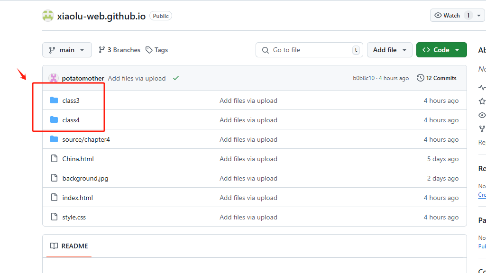
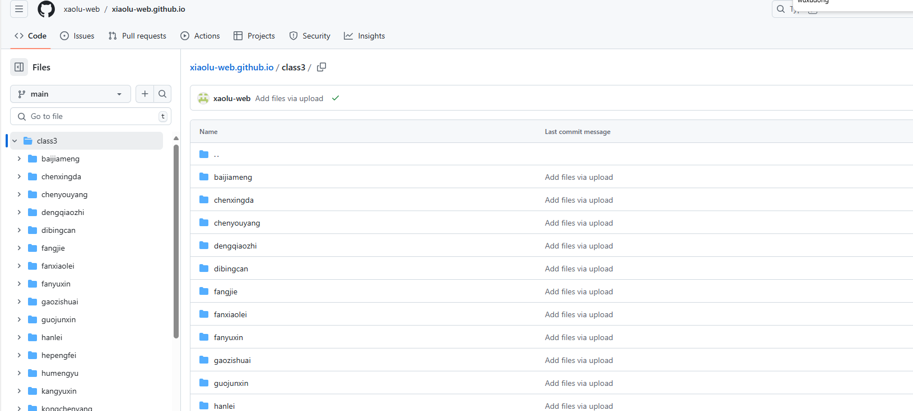
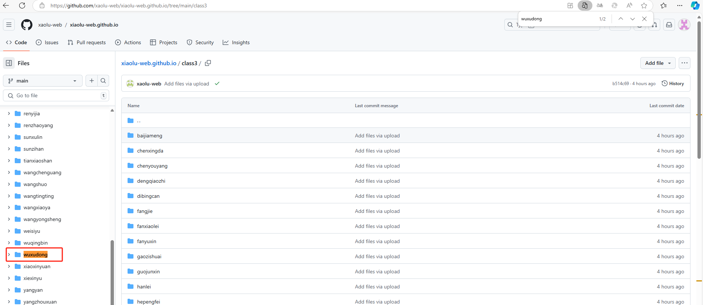
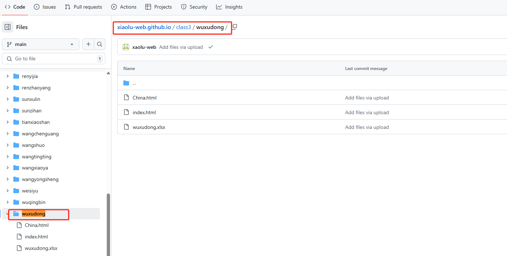
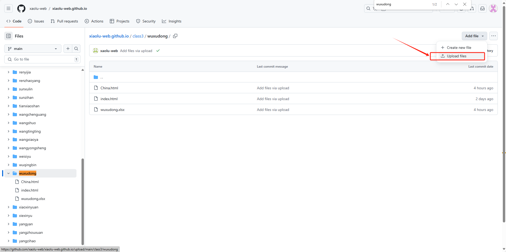
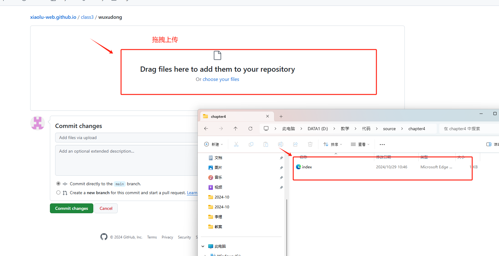
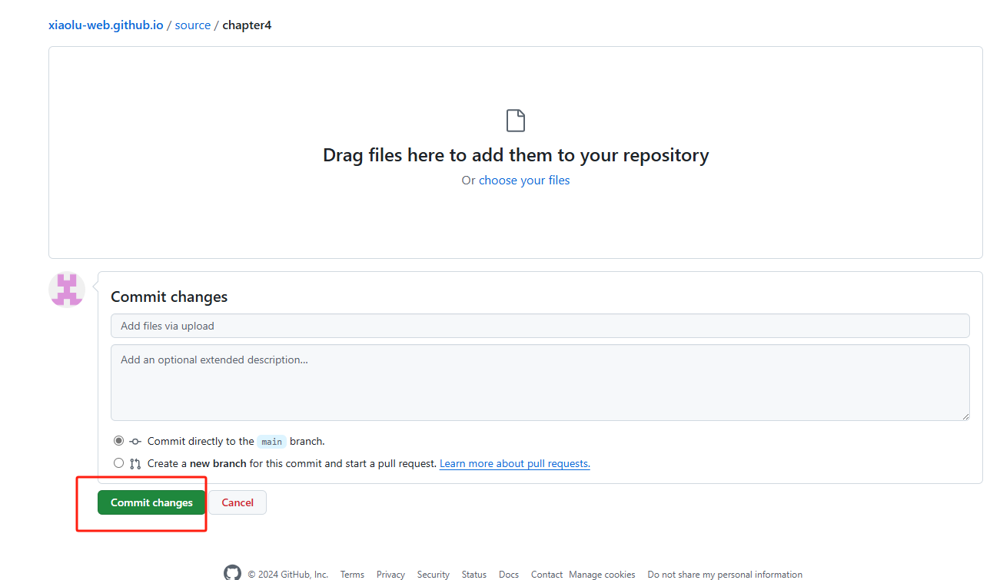

## 导言
本资源为邯郸科技职业学院
24级计算机系计算机应用技术3-4班 HTML5+CSS3开发课程进行维护
  

  - 项目贡献者&维护者： 邯郸科技职业学院 24级计算机系计算机应用技术3-4班
  
### 个人资源上传说明
1. 将自己的静态网站代码以如下方式整理
   - index.html
   - style.css (按需增加)
   - javascript.js(按需增加)
   - xxx.jpg 资源图片 （按需增加）
2. 在本项目中找到对应班级 上传对应文件夹如：class3/class4
 
 点击文件夹，进入
 
4. 在班级文件夹中找到自己的名字拼音的文件夹 例如：3班武旭东 访问 `class3/wuxudong`
   
  
5. 将1.中所提到的相关文件上传对应的姓名文件夹。
   
   
   提交文件
   
### 个人资源扩展说明
每个人的文件夹内可以选择部署多页面网站。多页面网站文件代码结构如下。

 - index.html (首页项目文件，索引到各页面，例如课本P30页首页网站可索引到各网页文件)
 - css（css文件夹）
     -  style.css
     -  .... (外部引用css文件)
 - javascript（javascript文件）

   - javascript.js
   - ... （外部引用js文件） 
 - picture（图片文件夹）
   - 网站中使用的图片文件
 - xxx.html (网页文件)
 - xxx.html(网页文件)
 - ....(网页文件)
### 网站地址
https://xaolu-web.github.io/xiaolu-web.github.io/

### 注
请在上传文件之前确认代码无误后再上传，上传完成后可访问网站地址，定位到每个人的网页/网站代码。
- 本课程的大作业最终需提交到本网站，当前可以将个人无误的课程代码/练习代码上传网站。
  
2024年10月29日 
